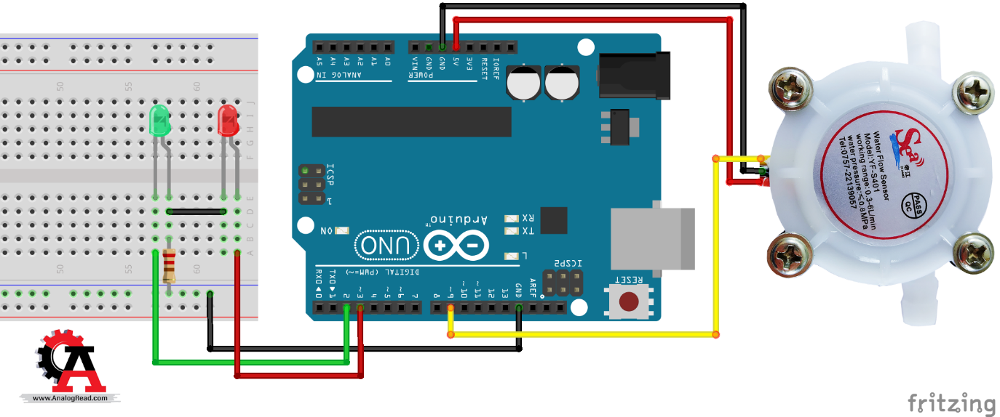

# Infusion pump

## Description
This project implements a water flow meter with an integrated pump control mechanism. It measures the flow rate of water and controls a pump accordingly. The system utilizes an Arduino board, a flow sensor, and a relay module to achieve this functionality.

## Features
- **Flow Measurement:** The flow sensor calculates the flow rate of water passing through it in liters per hour (L/hour).
- **LCD Display:** An LCD screen is used to display the current flow rate measured by the sensor.
- **Pump Control:** A relay module controls the operation of the pump based on the measured flow rate. The pump is turned on for a specified duration when needed.
- **Real-time Monitoring:** Flow rate data is continuously updated and displayed on the LCD screen.

## Components
- Arduino board
- Water pump
- Flow sensor (YF-S201)
- Relay module
- Liquid Crystal Display (LCD)
- Connecting wires

## Setup
1. Connect the flow sensor to the Arduino board according to the wiring diagram.
2. Connect the relay module to the Arduino board to control the pump.
3. Upload the provided Arduino sketch to the board.
4. Power on the system and monitor the flow rate on the LCD display.

## Usage
1. The system will continuously monitor the flow rate of water passing through the sensor.
2. The LCD screen will display the current flow rate in liters per hour (L/hour).
3. Based on the flow rate, the pump will be turned on for a specified duration to maintain the desired flow rate.
4. Adjustments to the pump operation can be made by modifying the Arduino sketch.

## Circuit Diagram

## Dependencies
- Arduino IDE
- LiquidCrystal library

## Contributing
Contributions, bug reports, and feature requests are welcome. Please follow the contribution guidelines.

## License
This project is licensed under the [MIT License](LICENSE).
